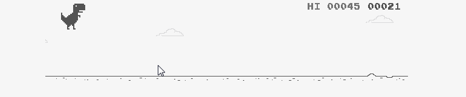

### Hi, I'm YASSINE CHERKAOUI

#### I am Full stack Developer And Student at YouCode <a href="https://stars.github.com/">GitHub Star 🌟</a>

<!--  -->

  

**Languages and Tools:**

<code></code>
<code></code>
<code></code>
<code></code>
<code></code>
<code></code>
<code></code>
<code></code>
<code></code>
<code></code>
<code></code>
<code></code>
<code></code>
<code></code>

